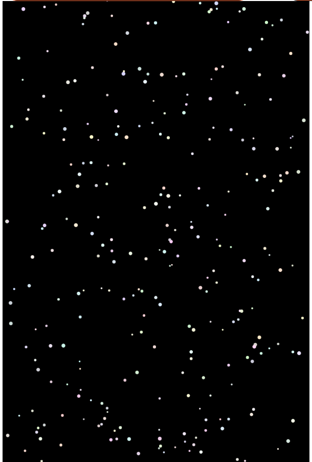
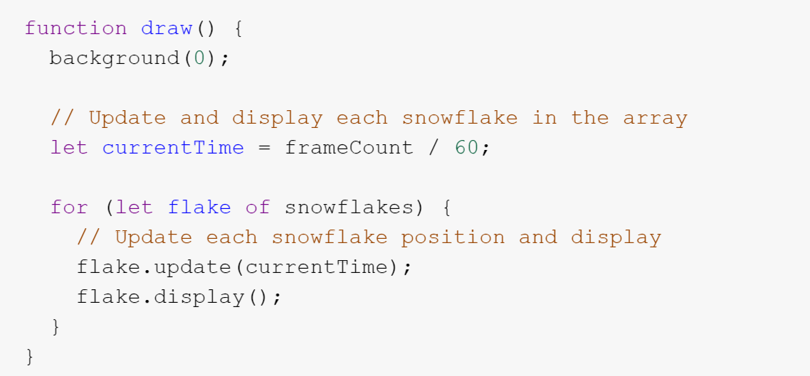

# Zfan0427_9103_tut5
# Imaging Technique Inspiration
- I will choose Snowflakes as a inspiration example for my assignment. This example provide a use of timebased animation. 

[Link to Snowflakes](https://p5js.org/examples/classes-and-objects-snowflakes/)

- This example successfully created an effect of snowflakes falling, and I think the slow descent of snowflakes in a rotating posture in this example is very appealing to me. In the final assignment, *time-based* or *randomness* animation effects are required. I believe this example contains the necessary elements and showcases beautiful effects.

# Coding Technique Exploration
[Link to Snowflakes](https://p5js.org/examples/classes-and-objects-snowflakes/)

- In this example, the author created a *current time* variable and divided **frameCount** by 60 to store it in this variable.
- By continuously updating the *current time* in the **for loop** and using flage.update, the animation can achieve the effect of constantly changing over time.

